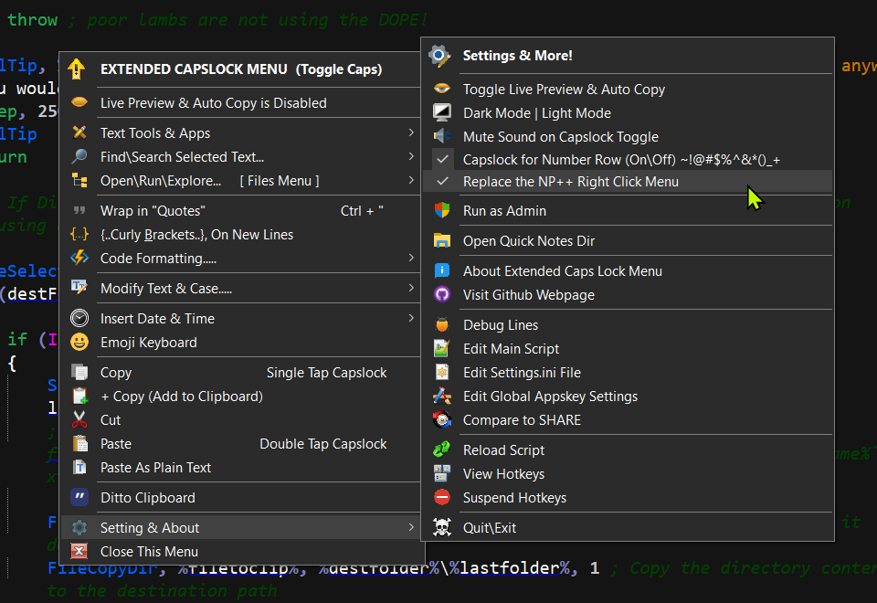
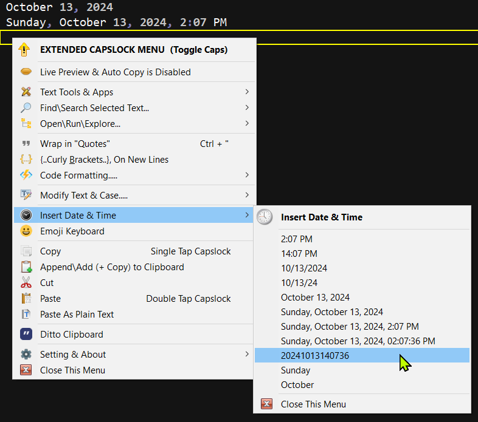
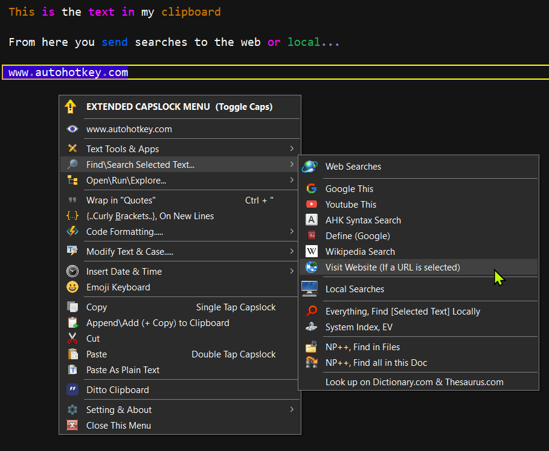
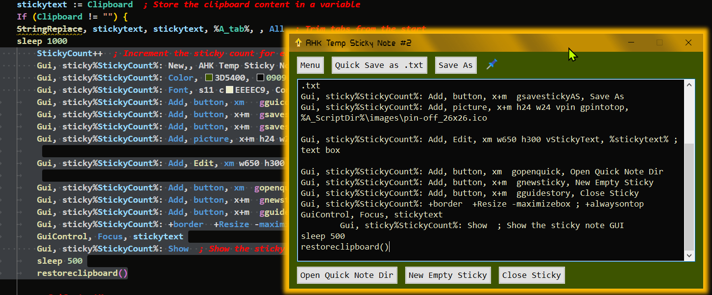

# Extended Capslock Context Menu

An AutoHotkey Context menu for working-playing-coding with text.

> this local readme.md might be out of date, for current info visit the GitHub @ [https://github.com/IndigoFairyX/Extended_Capslock_Context_Menu](https://github.com/IndigoFairyX/Extended_Capslock_Context_Menu)

# About Extended Capslock Menu

### This Extended Capslock Menu is a expanded context menu, written with [AutoHotkey](https://www.autohotkey.com).
### Its made for working\playing with text.
### With this menu, after *[\*SELECTING SOME TEXT\*]* and then picking a menu item, the text will be copied to your clipboard (with your previous clipboard item preserved) so you can...

	+ search the web or local computer (using free software),
	+ save selected text to a New Text Document(s),
	+ added some simple & quick code formatting around text (e.g. .md, .xml, .ahk),
	+ modify text & cOnVeRt cAsE,
 	+ convert between 12345 numbers && symbols %$#@!
	+ create temp stickies,
	+ append\add new text to your existing clipboard,
	+ save the text content of your clipboard to a new document,
	+ paste rich text as plane text,
	+ shows a GUI above the system try when your caps lock is toggled on,
	+ run apps,
	+ the basic cut, copy, paste,
	+ insert the date and time,
	+ shift your number row when capslock is ON, e.g.
		`1234567890-=[]\
		~!@#$%^&*()_+{}|

From the 'Open\Run\Explore\Files...  Menu' , you can ...
... When a Folder\File Path, Url, or Regkey path is [*SELECTED*]
e.g. C:\Users\YourUserName\Documents\AutoHotkey\Some Script File.ahk

	- Open a folder
	- Run\Open the file without navigating to it.
	*- Copy the file\folder to your clipboard
		*Requires Directory Opus.
			for windows explorer users it
			opens a 'Copy To..' dialogue.
	- copy the Content of a text-base file to you clipboard without opening it
	- copy directory details via the CMD prompt
	- make a Duplicate File Copy, adding a ' -CopyDup.ext' suffix
	- move a file, into it own sub-folder, or up into its parent folder
	- open RegEdit, to the select key
	- open a website from a none-hyperlinked text
	- open Everything 1.5a, to explore the folder
	- open Everything 1.5a, to search the filename
	- open the Windows Context Menu
	*+ open an alternative live folder to peek what else is there
		* it has it own hotkey as well 'Ctrl' + 'Space'
		* its limited to Notepad++ and Everything
		* in Notepad++, if nothing is selected,
		  it will show the Dir of the active file.

++ Other Features With Toggle Options ++

	+ light & dark mode toggle (DARK is default),
	+ sound beeps for capslock state change (ON by default)
	+ shifted number row, when caps on, (OFF by default)
		+ `1234567890-=
		+ ~!@#$%^&*()_+
	+ *+ Replace Notepad++'s Right Click Menu with this one! (OFF by Default)
	+ *+ Auto Copy & Live Preview Mode

++++ ADDITONAL MENUS ++++

	+ A custom built Open With\In Alternative Text Editor Menu that works in NP++ (on the active file viewing) and in Everything 1.5a (when a file is selected).
	+ The Hotkey for this Menu is {F9}
	+ There's a handful of light-weight text editors that I play with... This menu can be made to work in other applications...
	+ If you're an AHK enthusiast I recommend adding your own editors.

### ... And more !!! ... Check Out the Change Logs on the Releases pages for Features & Fixes & Screenshots & other details as they're added.

***

# To Run download the zip from [Releases Page](https://github.com/indigofairyx/Extended_Capslock_Context_Menu/releases)

## There are 3 options to run.

### \#1 Portable 
Simply Drag & Drop the `Extended Capslock Context Menu.ahk` file onto the "AutoHotkeyU64 - Shortcut.lnk" shortcut and it will run.
No installation is required to run this AutoHotkey Script, A portable version of AutoHotkey is included in this download.

### \#2 Run the `Extended Capslock Context Menu.ahk` if you already have AutoHotkey installed
If your already have AHK installed simply run the script as you normally would. \*\**This is my preferred way as I'm always editing and epanding this menu, you're free to edit the code as well.*

or, if you dont want to fuss with scripts...

### \#3 Run the `.exe`
A compiled `Extended Capslock Menu v.2025.XX.XX.exe` is included here. This will likely make windows fuss. click run anyway, the code is in the .ahk file.

Check out the about window from the setting menu for an more over of an overview.

**NOTE!!!** *This script needs to run from the folder its zipped in, or the icons will be missing and it will error out.*

## Hotkeys
***

## Extended CAPSLOCK KEY Functionality Using AutoHotkey:

`Capslock`, Single Tap, **COPY**

`Capslock`, Double Tap, **PASTE**

`Capslock`, ***HOLD, Show Extended Capslock Menu***

~~`Middle Mouse Button` -- Alt Mouse Hotkey to OPEN MENU~~

`Ctrl` + `Alt` + `F3` -- Alt Keyboard Hotkey to OPEN MENU

`Ctrl` + `Shift` + `F2` -- New Sticky Filled With Selection
  
`Ctrl` + `Alt` + `F2` -- New Empty Sticky Note
  
`Ctrl` + `Shift` + `R` -- Reload Script
  
--------------------------------------------------

~~`Alt` + `Capslock` -- Toggle Capslock~~

`Ctrl` + `Capslock` -- Toggle Caplock

`Shift` + `Capslock` -- Switch between UPPERCASE & lowercase

--------------------------------------------------

### --- Hotkeys for the Sticky Note GUI Windows ---

`Alt` + `M` -- Show Sticky GUI Quick Menu

`Ctrl` + `S` -- Save Sticky As

`Ctrl` + `Shift` + `S` -- Quick Save As '.txt'

`Ctrl` + `N` -- Create New Empty Temp Sticky

`Ctrl` + `P` -- Pin Sticky To Top

`Ctrl` + `Shift` + `O` -- Open Quick Notes Folder

`Ctrl` + `ESC` -- Close Stick without saving

**************************************************

## ----+++ OTHER HOTKEYS +++-----

`Ctrl` + `Shift` + `"` -- Paste Current Clipboard in "Quotes"

`Ctrl` + `"` -- Put Quotes Around \[\*"Selected Text"\*]
 
`Win` + `H` -- Add Auto Correct Hot Strings ...
		 ...(if include Auto Correct script is running)
		 
--------------------------------------------------

## ==+++ SPECIAL IF Notepad++ ACTIVE HOTKEYS +++==

`Right Click` -- Can replace NP++ menu with this one. (optional)

`Ctrl` + `Space` -- Open Live Folder Menu...
	if a \[* C:\Filepath.txt \*] is selected it show's that files folder
	if nothing is selected it will show the folder of the Active file
	+ this can also work in Everything 1.5a on a selected file
	- this menu hotkey is turn off else where
 
`Ctrl` + `Alt` + `N` or `F9` -- Open Active File in Alternative Text Editor Menu

***

# Screenshots
***

